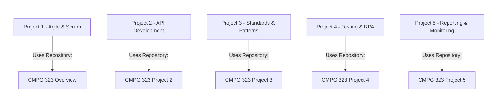
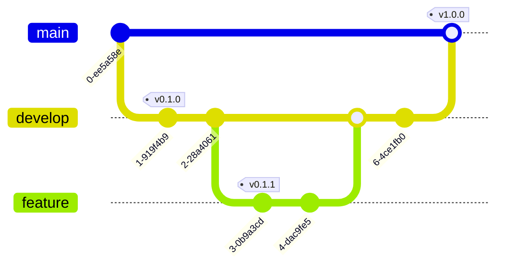
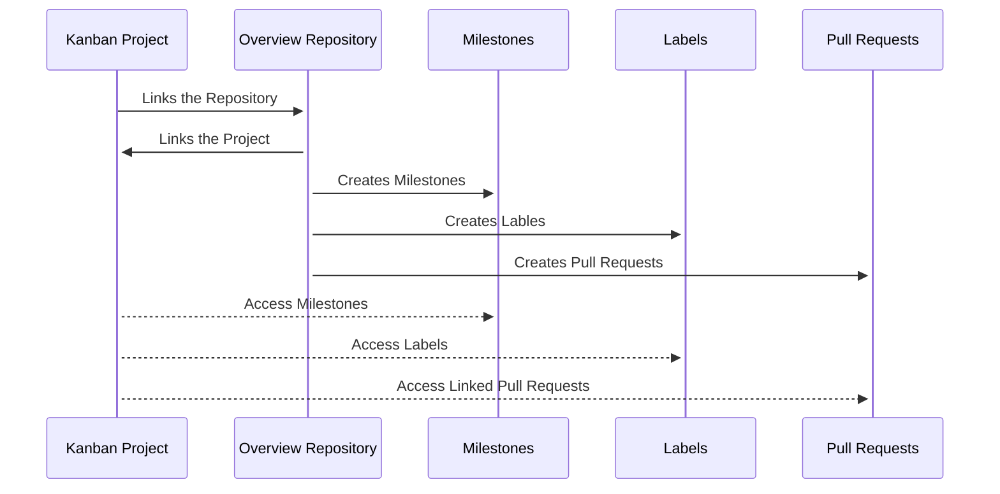

# CMPG-323-Overview-38205742

_This repository serves as an overview for all the projects._

## Project Repositories

  <strong>Semester Projects and Repsitories Overview</strong>

_Each project will have its own repository._

### [Project 1](https://github.com/Albert-Willemse/CMPG-323-Overview-38205742)

Agile & Scrum (Mandatory)

  
_Due Date: 10 August 2023_

Develop a project & repository, and use it throughout the semester. This project focuses on understanding Agile principles and Scrum methodology. 

Training in:

- Agile (Scrum)
- Source Control using GitHub.

### [Project 2](https://github.com/Albert-Willemse/CMPG-323-Project-2-38205742)

API Development

  
*Due Date: 31 August 2023*

Develop an API and host it on the Cloud. This project's value lies in using the API in the subsequent Reporting & Monitoring Project. 

Training in:

- Cloud Basics
- API Basics
- .NET Core

  
### Project 3 (Link to be added)

Standards & Patterns

  
*Due Date: 21 September 2023*

Apply Design Pattern to an existing project and host the Web App on the Cloud. This project aims to teach me how to adapt existing code and apply design patterns effectively. 

Training in: 

- Design Patterns Basics
- Architecture Pattern Basics
- Coding Standards Basics
- .NET Core MVC Web Application.

  
### Project 4 (Link to be added)

Testing & RPA

  
*Due Date: 19 October 2023*

Use UiPath to enter data from an existing dataset into an existing web application to conduct user testing. This project will introduce me to various testing techniques and teach me how to use RPA. 

Training in: 

- Testing Basics
- RPA & Automation Basics
- UiPath

  
### Project 5 (Link to be added)

Reporting & Monitoring

  
*Due Date: 26 October 2023*

Visualize backend data using API endpoints created in Project 2. This project focuses on creating basic yet meaningful reports.

Training in:

- Data Visualization Basics
- Dashboarding Versus Reporting Versus Monitoring (with Basics)
- Power BI

## Branching Strategy

I will be following the Gitflow branching strategy for all my projects. This strategy involves two main branches: `main` and `develop`. Each project will have its own feature branches based on the `develop` branch. Once a feature is complete, it will be merged back into the `develop` branch.

## .gitignore

I will use a `.gitignore` file to exclude unnecessary files and directories from being tracked by Git. This ensures that only relevant code and configuration files are included in the repositories.

## Storing Credentials

To ensure the security of sensitive information such as API keys and passwords, I will use environment variables to store these credentials. The environment variables will be set on the deployment platform securely, and they will not be stored in the repositories.

## Kanban Project & Progress Tracking

My GitHub Kanban project will help me visualize my progress throughout the semester. I've set up different views to track tasks, sprints, and assessment deadlines. I will regularly update the Kanban board to reflect the current status of tasks.

### How the project and repository are integrated

### Sprint 1 - Burndown chart

### _Sprint 2 - Burndown chart_
### Sprint 3 - Burndown chart
### Sprint 4 - Burndown chart
### Sprint 5 - Burndown chart
### Sprint 6 - Burndown chart
### Sprint 7 - Burndown chart

